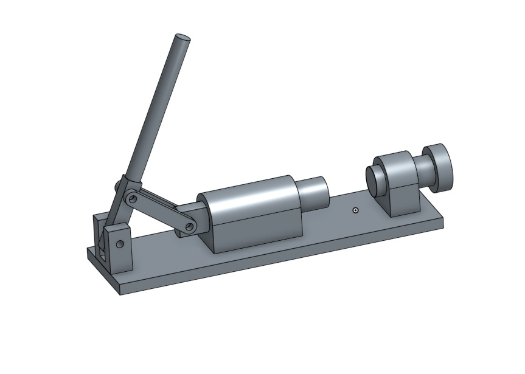

Title: 20170113W18
Date: 2017-01-13 12:00
Category: Misc
Tags: 上課內容
Author: 40423228

2016Fall 電腦輔助設計實習課程總結
1.創造力三元素

自學能力、程式能力、想像能力

2.自我表達方式

口語、文字及2D、3D的圖像表達能力、理論分析表達、實體表達。

3.可攜式 Python3程式環境

在任一台電腦上，利用leo editor管理及編輯md檔和reveal投影片，再利用git指令將資料推送到github。

4.Solvespace 參數 3D 繪圖系統
<iframe src="./../data/W13_1.html" width="800" height="600"></iframe>
<iframe src="./../data/W13_2.html" width="800" height="600"></iframe>
<iframe src="./../data/W13_3.html" width="800" height="600"></iframe>

5.Onshape  3D 繪圖系統

6.零組件繪圖練習

7.ShareX 取畫面圖像與操作影片錄製

8.Github submodule 網際協同

這學期沒有練習，將在下學期進行。

心得:

